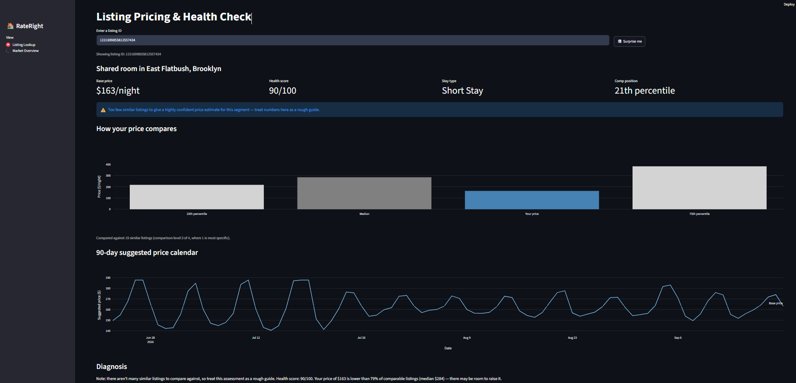

# RateRight
**AI-Powered Pricing & Listing Health Assistant for Short-Term Rental Hosts**

*Know your right price, every night.*

RateRight benchmarks a short-term rental listing against similar nearby listings, predicts a fair nightly base price, builds a 90-day demand-adjusted price calendar, and diagnoses why a listing might not be performing — in plain English, backed by real numbers. It's built on ~30,000 NYC Airbnb listings from Inside Airbnb (snapshot: 14 June 2026), and every design decision in it is aimed at the kind of work a PriceLabs Product Specialist or Data Scientist actually does: benchmarking prices, explaining data to customers, and being honest about what the data can and can't tell you.

---

## The problem

A host asks: *"Is my price right? Why isn't my listing booking? What should I charge tonight vs. next Saturday?"*

RateRight answers all three, using only publicly available listing and calendar data — no booking history, no price history. That constraint shaped almost every decision in this project, and is documented throughout rather than glossed over.

---

## What it does

1. **Comparable-listing benchmarking** — for any listing, finds similar listings nearby (same neighbourhood, room type, stay type, bedroom count, with an automatic fallback to broader groups when there aren't enough close comparables) and shows where its price sits.
2. **Base price prediction** — a LightGBM model trained on ~21,500 listings predicts a fair nightly base price, beating a strong comparable-listings baseline.
3. **90-day price calendar** — combines the base price with a demand baseline (how far ahead guests typically book) and weekday/date-specific demand excess (weekends, summer dates) into a day-by-day suggested price, capped at ±15%.
4. **Listing health score** — 7 transparent, rule-based flags (overpriced, underpriced, high availability, gone quiet, rating gap, restrictive stay rules, price outlier) roll up into a 0–100 score.
5. **Plain-English diagnosis** — template-based (not an LLM), hedged, number-backed sentences explaining what's wrong, ordered by severity.
6. **Streamlit app** — search any listing, or hit "Surprise me," to see all of the above live.

---

## Architecture

```
Inside Airbnb CSVs (listings, calendar, reviews)
        │
        ▼
  BRONZE  (src/ingest.py)        raw → Parquet, no type conversion
        │
        ▼
  SILVER  (src/clean.py)         types fixed, known bad values removed
        │
        ▼
  GOLD — prepare  (src/prepare.py)
        │   stay type, license status, studio-filled bedrooms,
        │   base price, outlier flag, price_confidence flag
        │
        ├──► comps.py            comparable-listing benchmarks (fallback chain)
        ├──► features.py + model_linear.py + model_lgbm.py
        │                        base price model (LightGBM chosen)
        ├──► demand.py           days-ahead demand baseline
        ├──► demand_adjustments.py   weekday & date-specific demand excess
        ├──► price_calendar.py   90-day suggested price per listing
        └──► health.py           7-flag health score
                    │
                    ▼
              diagnosis.py       plain-English, number-backed sentences
                    │
                    ▼
         app/streamlit_app.py    interactive lookup + market overview
```

Every stage writes a Parquet file others depend on; nothing is recomputed on the fly in the app.

---

## Key design decisions

Full reasoning and evidence for every decision below lives in `docs/eda_decisions.md` and `docs/model_comparison.md`.

- **The listed price is a 30-night, post-discount quote, not a simple nightly rate.** Discovered during cleaning: Inside Airbnb quotes each listing at its own minimum stay, and ~50% of 28+ night quotes carry a length-of-stay discount. RateRight models the **pre-discount** nightly price as its target, since that's closer to what PriceLabs calls a "base price."
- **Short stays and monthly stays are different markets, not different sizes of the same market.** Short-stay listings cost 2–3× more than monthly ones *within the same room type*, driven by NYC's short-term rental registration rules (94% of short stays are licensed/exempt vs. <1% of monthly stays). Both get separate treatment throughout.
- **Comparable-listing groups use a fallback chain**, not one fixed grouping: neighbourhood+room+stay+bedrooms → neighbourhood+room+stay → borough+room+stay → citywide, always requiring 10+ other (non-outlier) listings. This gets 99.9% of listings a comparison, while keeping it as narrow as the data allows.
- **LightGBM was chosen over linear regression** after honestly comparing both against two baselines. Linear regression didn't beat a simple comparable-listings median (30.8% vs 30.1% error) — it couldn't capture interactions like "an extra bedroom is worth more in Manhattan." LightGBM did (25.1% error, 40.1% of predictions within 20% of actual).
- **The demand curve strips out a booking-window artifact.** Raw calendar data showed suspicious jumps at ~3, 6, and 9 months out — traced to Airbnb's per-host booking-window settings, not real demand. The final demand baseline uses only listings whose calendars are open ~a year ahead.
- **The price calendar's demand-to-price conversion is an explicit business rule (capped at ±15%), not a learned elasticity** — there's no booking/price history in this data to learn one from, and the README says so rather than dressing up a guess as a model.
- **The health score and diagnosis are rule-based, not ML**, on purpose: a host needs to know *exactly* why they got flagged, and every sentence traces back to a real calculated number.

---

## Results: base price model

| Model | Median % error | Within 20% of actual |
|---|---:|---:|
| Segment median (room + stay type only) | 39.7% | 26.6% |
| Comparable-listings median (this project's own benchmark) | 30.1% | 35.3% |
| Linear regression | 30.8% | 34.7% |
| **LightGBM (used in the app)** | **25.1%** | **40.1%** |

Full comparison, including an investigated-and-explained feature importance anomaly and a documented case of mild overfitting, in `docs/model_comparison.md`.

---

## Limitations

RateRight is built on **listed, active-listing data only** — no actual bookings, no price history, single city, single snapshot. Specifically:

- Prices are what hosts *ask*, not what guests *paid*.
- The model only applies to **active listings** (71% of listings have a price at all; unpriced ones are mostly inactive).
- There is no nightly price history, so the 90-day price calendar is built from availability-based demand patterns and a capped adjustment rule — not a learned price-to-demand relationship.
- "Unavailable" in the calendar isn't the same as "booked" — hosts also block dates manually.
- Two rare segments (Hotel room + monthly stay: 0 training listings; Shared room + short stay: 40 listings) have too little data for a confident prediction — these are explicitly flagged as `price_confidence = "low"` rather than given a falsely precise number.
- Results reflect NYC's short-term rental regulations specifically and may not generalise to other cities.

---

## Setup

```bash
python -m venv .venv
source .venv/bin/activate   # or .venv\Scripts\activate on Windows
pip install -r requirements.txt
```

Download the NYC listings, calendar, and reviews CSVs from [insideairbnb.com](http://insideairbnb.com) and place them in `data/raw/nyc/`.

Run the full pipeline in order:

```bash
python src/ingest.py
python src/clean.py
python src/prepare.py
python src/comps.py
python src/features.py
python src/model_lgbm.py
python src/demand.py
python src/demand_adjustments.py
python src/price_calendar.py
python src/health.py
python src/diagnosis.py
```

Then launch the app:

```bash
streamlit run app/streamlit_app.py
```

---

## RateRight Assistant

<p align="center">
  
</p>

## Project structure

```
RateRight/
├── data/                    (not in git — see Setup)
│   ├── raw/nyc/             downloaded CSVs
│   ├── bronze/nyc/          raw → Parquet
│   ├── silver/nyc/          cleaned & typed
│   └── gold/nyc/            all modelled/derived outputs
├── src/                     the pipeline (see Architecture)
├── notebooks/               exploration & validation, one per milestone
├── models/                  saved trained models (.joblib)
├── app/
│   └── streamlit_app.py
├── docs/
│   ├── data_notes.md        running log of every finding, bug, and fix
│   ├── eda_decisions.md     exploration findings → decisions, with evidence
│   └── model_comparison.md  full model comparison and investigation
└── requirements.txt
```

`docs/data_notes.md` is a complete, chronological record of the project — every bug found, root-caused, and fixed, with the evidence behind each decision. It's the fastest way to see the actual process behind this README's conclusions.
